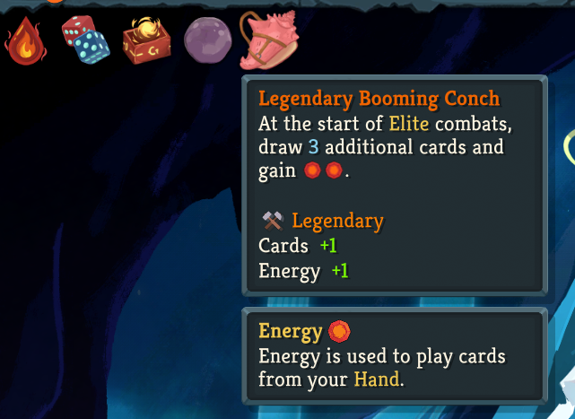

# StS2 Relic Forge (유물 접두사)

**슬레이 더 스파이어 2** 모드로, 얻는 유물에 **테라리아식 접두사**를 붙입니다 — '닻'이 더 많은 방어도를 주는 **전설적인 닻**이 되거나, 다른 유물의 효과까지 얹는 **닻내린** 유물이 됩니다. 그리고 모닥불에서 **재련**해 원하는 결과를 노릴 수 있습니다. 가벼운 파워 판타지 모드입니다.

[English README](README.md)



---

## 무엇을 하나

- **얻는 유물에 접두사** — 상점·보상·보물·이벤트로 얻는 대부분의 유물이 접두사를 굴립니다. 시드 고정이라 같은 시드=같은 결과, 저장/로드 후에도 유지됩니다.
- **접두사 3종류** (전체 목록은 [접두사 가이드](PREFIXES.ko.md)):
  - **수치** — 유물의 수치를 올립니다(드물게 내림). 전설적인 닻 = 더 많은 방어도.
  - **동반** — 다른 유물의 효과를 **약화된 버전**으로 부여합니다. '가시돋친'은 전투 시작 시 가시. 어떤 유물에나 붙습니다.
  - **페널티** — 작은 저주(테라리아식 나쁜 롤, 소수): 자신에게 디버프를 걸거나 저주 카드를 덱에 넣습니다.
- **모닥불 재련** — 휴식처에 **재련** 옵션이 생겨 유물의 접두사를 다시 굴립니다. 무료·반복 가능이고 휴식을 소모하지 않지만, 유물에 **안좋은 기운**(페널티 접두사)이 서리면 그 모닥불에선 재련이 끝납니다.
- **등급 색 이름** — 강화된 유물 이름이 접두사 등급 색으로 물듭니다(전설=금색, 부서진=빨강 …).
- **설정 가능** — ModConfig 슬라이더로 접두사가 안 붙을 확률을 조절합니다(기본 60% 바닐라 = 약 40%만 강화).

## 접두사

단일 가중 풀 — 어떤 유물이든 어떤 접두사든 붙을 수 있습니다. 전체 이름·효과·확률은 **[접두사 가이드](PREFIXES.ko.md)** ([English](PREFIXES.en.md) · [简体中文](PREFIXES.zh.md))와 인터랙티브 [`prefix_dashboard.html`](prefix_dashboard.html)에 있습니다.

- **수치** — 전설적인(+60%) … 날카로운(+4%), 증폭 접두사 **불안정한**, 순화된 음수(금이 간 / 하찮은 / 부서진).
- **동반** — 기증 유물의 효과를 축소해 부여하는 테마 접두사(가시돋친, 강건한, 닻내린, 피끓는 등).
- **페널티** — 저주받은 / 무거운 / 변덕스러운 / 과부하(자기 디버프), 오염된 / 곪은 / 불타는 / 공허한(저주 카드 생성).

**접두사는 계속 추가될 예정입니다.**

## 재련

모든 모닥불에 **재련** 옵션이 있습니다:

- 유물 하나를 골라 접두사를 다시 굴립니다 — "접두사 없음"이 나왔거나 애초에 대상이 아니던 유물도 재련하면 접두사가 붙습니다.
- **무료·반복 가능**(휴식 미소모)이고, 힐이나 대장간을 써도 재련 옵션은 남습니다.
- 각 재련은 런 시드+재련 횟수로 **결정적**이고 **저장**되므로 세이브 스컴이 안 됩니다.
- 대가: 재련이 **페널티** 접두사를 뽑으면 유물에 안좋은 기운이 서려 그 모닥불의 재련이 끝납니다 — 욕심에는 위험이 따릅니다.

## 원리

모든 유물은 툴팁 숫자와 같은 `DynamicVars`에서 효과 크기를 읽으므로, 기본값만 바꾸면 효과와 표시가 한 번에 갱신됩니다 — 유물별 코드 없이, 수치가 있는 모드 유물도 자동 지원됩니다. 동반 접두사는 숨은 기증 유물 인스턴스를 부여해 그 네이티브 훅이 발동하고, 페널티는 전투 훅으로 적용됩니다.

## 참고

- **밸런스 모드 아님** — 런을 더 강하게(약간의 리스크와 함께) 만드는 파워 판타지/캐주얼용입니다.
- **접두사 비활성화** — ModConfig "접두사 미적용 확률"을 100%로 두면 순수 바닐라 유물이 됩니다.
- 지원 언어: English, 한국어, 简体中文.

## 설치

1. Steam 창작마당 구독, 또는 최신 릴리즈 다운로드.
2. 수동 설치 시 `Sts2RelicForge/` 폴더를 `<Slay the Spire 2 설치경로>/mods/`에 넣습니다(`Sts2RelicForge.dll`·`.json`·`.pck` 포함).
3. 게임 실행.

## 소스 빌드

요구사항: .NET SDK, Godot.NET.Sdk 4.5.1(자동 해결), 로컬 Slay the Spire 2 설치, 옆에 위치한 `Sts2.ModKit` 프로젝트.

```sh
dotnet build Sts2RelicForge.csproj -c Debug
```

`prefix_dashboard.html`은 유물 × 접두사 결과를 전부 보여주는 독립 참조 문서입니다.

## 라이선스

MIT — [LICENSE](LICENSE) 참조. MegaCrit의 Slay the Spire 2 기반.
